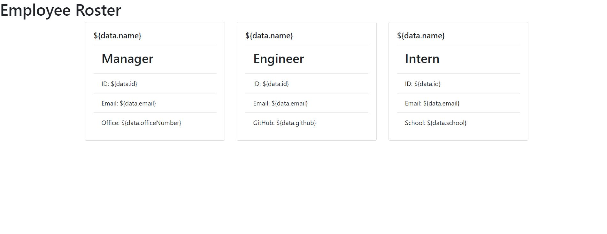
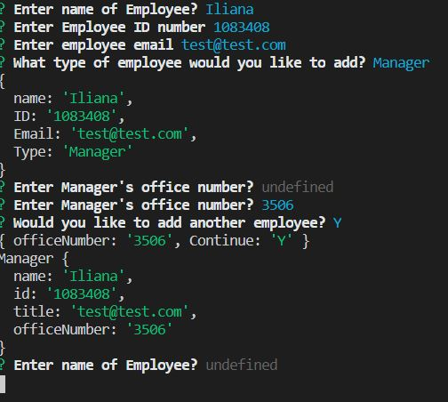

# EmployeeTemplateEngine
* This app generates a list of employees for a company.
* To use one must first enter 'npm i' and will answer prompts on the terminal.

* Screenshot of what website looks like currently.

* Screenshot of terminal prompts.

* Shotout to all those who helped me get this far with this assignment!